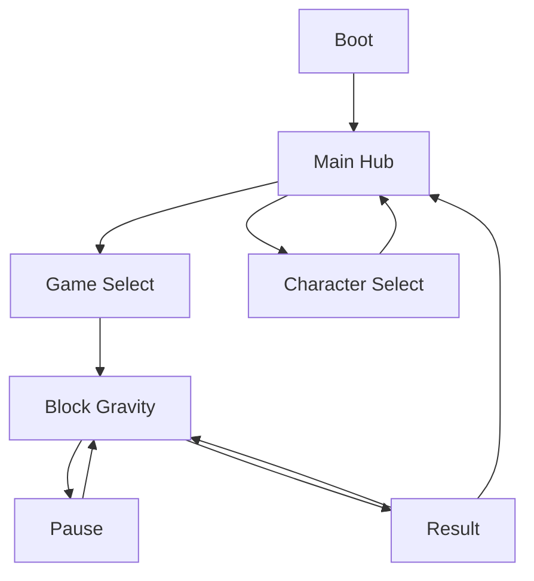

# 미니게임 허브 프로젝트 MVP 개발 명세서

> 문서 목적: 이 파일을 Unity 프로젝트 저장소 루트에 두고 Codex에 전달하여, 프로젝트 초기 세팅부터 첫 번째 미니게임 `Block Gravity`의 플레이 가능한 Android MVP까지 단계적으로 구현한다.
>
> 작업명(가칭): **Pocket Arcade**  
> 문서 버전: 0.1  
> 작성일: 2026-09-17

---

## 0. Codex에 처음 전달할 지시문

아래 문장을 이 명세서와 함께 Codex에 전달한다.

```text
저장소 루트의 MiniGameHeaven_Unity_MVP_Spec.md를 전체 확인하고 이 문서를 제품 및 기술 명세의 기준으로 사용해줘.

우선 현재 Unity 프로젝트와 Git 상태를 읽기 전용으로 점검하고, 명세와 충돌하거나 빠진 전제조건을 보고해줘. 문제가 없다면 Phase 0과 Phase 1만 구현해줘. 한 번에 전 범위를 구현하지 말고 각 Phase가 끝날 때마다 다음 내용을 보고한 뒤 멈춰줘.

1. 생성/수정한 파일
2. Unity Editor에서 내가 직접 해야 할 작업
3. 실행한 테스트와 결과
4. 현재 플레이 가능한 범위
5. 다음 Phase에서 할 일

Unity MCP가 연결되어 있으면 씬, 프리팹, ScriptableObject 생성과 Play Mode 확인에 사용해. MCP가 연결되지 않았거나 작업 도중 실패하면 임의의 우회 자동화를 만들지 말고, C#과 에디터 스크립트까지 준비한 뒤 내가 Unity Editor에서 수행할 정확한 절차를 알려줘.

기존 사용자 파일과 설정을 임의로 삭제하거나 덮어쓰지 마. 패키지를 추가하거나 ProjectSettings를 크게 바꾸기 전에는 변경 이유를 먼저 설명해줘. 컴파일 오류가 남은 상태로 Phase를 완료했다고 보고하지 마.
```

---

## 1. 제품 개요

### 1.1 한 줄 설명

세로 화면에서 한 손으로 짧게 즐기는 여러 미니게임과, 수집·선택 가능한 캐릭터를 하나의 앱에 담은 모바일 캐주얼 게임이다.

### 1.2 제품 방향

- 한 게임의 규칙을 10초 안에 이해할 수 있어야 한다.
- 한 판은 평균 1~3분을 목표로 한다.
- 모든 핵심 조작은 세로 화면에서 한 손으로 가능해야 한다.
- 실패 후 2회 이내의 입력으로 다시 시작할 수 있어야 한다.
- 미니게임을 독립 모듈로 추가할 수 있어야 한다.
- 초기 버전은 서버 없이 로컬에서 완결되어야 한다.
- 첫 번째 완성 목표는 매출이 아니라 `Android 빌드 배포 가능 + 실제 플레이 루프 완성`이다.

### 1.3 레퍼런스에서 가져올 요소

- 미니게임천국: 여러 미니게임을 한 허브에서 고르는 구조, 캐릭터 선택과 수집 동기.
- Block Blast 계열: 세로 화면, 짧은 판, 직관적인 블록 배치, 즉시 재시작.
- 그대로 복제하지 않고 `중력 방향 변화`를 핵심 차별점으로 삼는다.

### 1.4 MVP 범위

MVP에 포함한다.

- 앱 시작 및 로컬 데이터 로드
- 메인 허브
- 미니게임 선택 화면
- 캐릭터 선택 화면
- 캐릭터 3종의 임시 비주얼과 선택 상태 저장
- 첫 번째 미니게임 `Block Gravity`
- 일시정지, 게임 오버, 재시작, 허브 복귀
- 최고 점수와 재화 저장
- Android 개발 빌드
- 핵심 로직 Edit Mode 테스트

MVP에서 제외한다.

- 로그인, 서버, 클라우드 저장, 랭킹 서버
- 광고, 인앱 결제, 상점
- 일일 퀘스트, 업적, 출석
- 캐릭터별 패시브 능력
- 멀티플레이
- Addressables 및 원격 다운로드
- DOTS/ECS
- 과도한 연출, 고급 셰이더, 진동 플러그인
- 두 번째 미니게임의 실제 구현

---

## 2. 개발 환경 및 설치 기준

### 2.1 Unity 버전

- 기준 에디터: **Unity 6.3 LTS의 최신 패치 버전**
- 이 문서 작성 시 확인 가능한 기준 버전: `6000.3.23f1`
- Unity Hub에 더 최신 `6000.3.x LTS` 패치가 표시되면 그 버전을 우선한다.
- 최신 기능 릴리스인 Unity 6.6보다 LTS를 우선한다.
- 기존 Unity 버전은 새 LTS와 나란히 설치할 수 있다. 새 프로젝트가 정상적으로 열리고 Android 빌드까지 확인된 다음, 디스크 공간이 필요할 때만 기존 버전을 제거한다.

Unity Hub 설치 모듈:

- Microsoft Visual Studio 또는 기존 외부 스크립트 에디터 연결
- Android Build Support
- Android SDK & NDK Tools
- OpenJDK
- 한국어 언어 팩은 선택 사항

### 2.2 프로젝트 생성

- 템플릿: `Universal 2D`
- 프로젝트명 가칭: `PocketArcade`
- 회사명 가칭: 개인 개발자명 또는 임시값
- 패키지 식별자 가칭: `com.[developer].pocketarcade`
- 기본 방향: Portrait
- 기준 해상도: 1080 × 1920, UI는 비율 대응
- 최소 목표 플랫폼: Android
- 초기 목표 프레임: 60 FPS
- Color Space: Linear
- Input: Input System Package (New)

### 2.3 필수 패키지

프로젝트에 실제로 필요한 최소 패키지만 유지한다.

- Input System
- TextMeshPro
- Unity Test Framework
- Universal Render Pipeline / 2D Renderer
- Unity AI Assistant 패키지: 공식 Unity MCP 사용 시

처음부터 넣지 않는다.

- Addressables
- Entities/DOTS
- Cinemachine
- Localization
- 광고 및 IAP SDK
- 외부 DI 프레임워크
- 외부 세이브 프레임워크

### 2.4 Unity MCP 연결

공식 Unity MCP를 우선 사용한다. 서로 다른 Unity MCP 패키지를 동시에 설치하지 않는다.

설치 및 확인 절차:

1. Unity Hub에서 Unity 계정으로 로그인한다.
2. 프로젝트를 Unity 6.3 LTS로 연다.
3. Package Manager에서 Unity AI Assistant 패키지를 설치한다. 프리릴리스 패키지만 보이면 프리릴리스 표시를 허용한 뒤 설치한다.
4. `Edit > Project Settings > AI > Unity MCP`를 연다.
5. MCP 서버를 활성화하고 화면에 표시되는 Codex용 연결 설정을 사용한다. 포트와 실행 명령은 패키지 버전에 따라 바뀔 수 있으므로 명세에 하드코딩하지 않는다.
6. Codex를 재시작하거나 MCP 설정을 다시 로드한다.
7. Unity Editor를 연 상태에서 Codex가 다음을 수행할 수 있는지 확인한다.
   - 현재 열린 프로젝트 정보 읽기
   - Hierarchy 및 활성 Scene 조회
   - 빈 GameObject 하나 생성 후 삭제
   - Console 오류 조회
   - Edit Mode 테스트 실행
8. 테스트용 오브젝트가 남지 않았고 Console에 컴파일 오류가 없는지 확인한다.

MCP는 보조 수단이다. 게임의 런타임 코드가 MCP에 의존하면 안 된다.

### 2.5 버전 관리

- Git 저장소를 프로젝트 시작과 동시에 생성한다.
- Unity용 `.gitignore`를 적용한다.
- `Assets`, `Packages`, `ProjectSettings`는 커밋한다.
- `Library`, `Temp`, `Logs`, `UserSettings`, 빌드 산출물은 커밋하지 않는다.
- 대용량 아트 리소스 도입 전까지 Git LFS는 사용하지 않아도 된다.
- 각 Phase가 컴파일과 테스트를 통과한 시점에 커밋 가능한 상태를 만든다.

---

## 3. 사용자 경험과 화면 흐름



### 3.1 Boot

- 로컬 저장 데이터 로드 및 버전 마이그레이션.
- 데이터가 없거나 손상되면 기본값 생성.
- 초기화가 끝나면 Main Hub로 이동.
- MVP에서는 별도 로딩 연출 없이 로고 또는 단색 화면만 사용 가능.

### 3.2 Main Hub

필수 표시:

- 현재 선택 캐릭터
- 보유 코인
- `게임 시작` 버튼
- `캐릭터` 버튼
- 설정 버튼

캐릭터를 눌렀을 때 Character Select로 이동하고, 게임 시작을 누르면 Game Select로 이동한다.

### 3.3 Game Select

- 첫 카드: `Block Gravity`, 선택 가능
- 두 번째와 세 번째 카드: `Coming Soon`, 잠금 상태
- 각 카드가 독립적인 `MiniGameDefinition` 데이터를 사용해야 한다.
- 잠긴 카드는 눌러도 씬을 열지 않고 간단한 안내만 표시한다.

### 3.4 Character Select

- 캐릭터 3종을 가로 카드 또는 캐러셀로 표시한다.
- MVP에서는 세 캐릭터 모두 기본 해금 상태다.
- 캐릭터 차이는 이름, 대표 색, 아이콘/스프라이트뿐이다.
- 선택 즉시 로컬 저장 후 허브에 반영한다.
- 능력 슬롯용 데이터 필드는 둘 수 있지만 실제 게임 효과는 구현하지 않는다.

임시 캐릭터:

| ID | 이름(가칭) | 대표 색 | MVP 기능 |
| --- | --- | --- | --- |
| `char_momo` | 모모 | Coral | 외형 선택 |
| `char_bori` | 보리 | Mint | 외형 선택 |
| `char_nabi` | 나비 | Violet | 외형 선택 |

### 3.5 설정

- BGM On/Off
- SFX On/Off
- 진동 On/Off 값 저장
- 실제 BGM 리소스가 없으면 토글과 저장 구조까지만 구현
- 데이터 초기화는 개발 빌드에서만 노출하거나 2단계 확인 팝업을 사용

---

## 4. 첫 번째 미니게임: Block Gravity

### 4.1 한 줄 규칙

> 블록 조각을 놓아 가로 또는 세로 줄을 완성한다. 일정 횟수마다 중력이 회전하며 모든 블록이 쏠린다.

### 4.2 보드와 기본 상태

- 보드 크기: 8 × 8
- 시작 상태: 모든 칸이 비어 있음
- 시작 중력: 아래쪽 `Down`
- 중력 순환: `Down → Left → Up → Right → Down`
- 중력 변경 주기: 블록 조각 5개 배치마다
- 화면에 현재 중력과 `중력 변경까지 남은 배치 수`를 항상 표시한다.
- 다음 중력 방향도 아이콘으로 미리 보여준다.

### 4.3 블록 조각

- 화면 하단 트레이에 조각 3개를 제시한다.
- 플레이어는 세 조각 중 하나를 보드로 드래그해 배치한다.
- 조각을 모두 사용하면 새로운 조각 3개를 생성한다.
- 배치 가능한 칸에는 반투명 프리뷰를 표시한다.
- 잘못된 위치에서 손을 놓으면 원래 트레이로 복귀한다.
- 드래그 중 조각이 손가락에 가리지 않도록 일정 픽셀 위에 표시한다.
- 모든 조각은 90도 회전 없이 생성된 방향 그대로 사용한다.

MVP 조각 풀:

- 단일 칸
- 2칸 직선: 가로/세로
- 3칸 직선: 가로/세로
- 2×2 사각형
- 3칸 L
- 4칸 L
- 3칸 코너
- 3칸 T

조각 모양은 `PieceDefinition` ScriptableObject 또는 직렬화 가능한 좌표 데이터로 정의하며, 코드에 거대한 switch 문으로 하드코딩하지 않는다.

### 4.4 한 턴의 정확한 처리 순서

1. 사용자가 조각을 유효한 위치에 배치한다.
2. 조각의 각 셀을 보드의 독립 셀로 확정한다.
3. 현재 중력 방향으로 모든 셀을 빈틈없이 이동시킨다.
4. 가득 찬 가로줄과 세로줄을 동시에 탐색한다.
5. 완성된 줄을 동시에 제거하고 점수를 계산한다.
6. 제거 후 중력 방향으로 다시 정렬한다.
7. 새 줄이 완성되면 연쇄 제거를 반복한다.
8. 해당 조각을 사용 처리하고 배치 횟수를 1 증가시킨다.
9. 5번째 배치라면 다음 중력 방향으로 변경한다.
10. 새 중력 방향으로 전체 셀을 다시 정렬하고, 생성된 줄 제거와 연쇄 처리를 수행한다.
11. 트레이의 조각을 모두 사용했다면 새 조각 3개를 생성한다.
12. 현재 트레이의 어떤 조각도 어떤 위치에도 놓을 수 없으면 게임 오버다.

중요 규칙:

- 배치한 폴리오미노는 고정된 한 덩어리로 움직이지 않는다. 배치 확정 후 각 칸이 독립 블록이 되어 중력 방향으로 이동한다.
- 블록 이동, 줄 삭제, 중력 변경 애니메이션 중에는 추가 입력을 받지 않는다.
- 가로줄과 세로줄이 동시에 완성되면 교차 셀은 한 번만 제거한다.
- 연쇄가 완전히 끝난 뒤에만 게임 오버를 판정한다.
- 애니메이션은 논리 보드 갱신 결과를 표현할 뿐이며, 게임 규칙이 Transform 상태에 의존하면 안 된다.

### 4.5 점수

MVP 점수 규칙:

- 조각 배치: 조각의 셀 수 × 10점
- 한 번의 판정에서 1줄 삭제: 100점
- 2줄 동시 삭제: 300점
- 3줄 동시 삭제: 600점
- 4줄 이상 동시 삭제: `1000 + (추가 줄 수 × 400)`점
- 같은 턴의 연쇄 2단계부터 연쇄 배수 적용: `기본 삭제 점수 × 연쇄 단계`
- 중력 변경으로 발생한 삭제도 같은 방식으로 계산

표시:

- 현재 점수
- 최고 점수
- 동시 삭제 수
- 연쇄 발생 시 `CHAIN x2`, `CHAIN x3` 텍스트

최고 점수는 게임 오버 시 저장하며, 현재 점수가 최고 기록을 넘는 순간 UI에는 즉시 반영한다.

### 4.6 재화 보상

- 한 판 보상 코인: `min(100, floor(score / 250))`
- 결과 화면에서 획득 코인을 표시한다.
- 게임 오버 결과를 확정할 때 한 번만 지급한다.
- 재시작, 허브 복귀, 앱 백그라운드 전환으로 중복 지급되면 안 된다.

### 4.7 게임 오버와 재시작

게임 오버 조건:

- 현재 트레이에 남아 있는 모든 조각에 대해 유효 배치 위치가 하나도 없다.

결과 화면:

- 최종 점수
- 최고 점수
- 획득 코인
- `다시 하기`
- `허브로`

`다시 하기`는 씬 전체를 반드시 재로드할 필요가 없다. 게임 세션 상태를 명시적으로 초기화하고 동일한 결과를 보장한다.

### 4.8 시각·청각 피드백

임시 도형과 색만으로도 아래 피드백은 구현한다.

- 유효/무효 배치 프리뷰
- 블록이 중력 방향으로 이동하는 0.1~0.25초 애니메이션
- 줄 삭제 플래시 또는 스케일 애니메이션
- 중력 변경 전 짧은 경고와 방향 화살표
- 점수 팝업
- 버튼 클릭 및 블록 삭제 SFX용 호출 지점
- 진동은 인터페이스만 두고 지원하지 않는 환경에서는 아무 작업도 하지 않음

연출 때문에 규칙 처리가 느려지지 않도록 애니메이션 시간은 설정 데이터로 분리한다.

---

## 5. 기술 구조

### 5.1 원칙

- 현재 규모에 맞는 단순한 구조를 사용한다.
- MonoBehaviour는 입력, Unity 생명주기, View 연결을 담당한다.
- 보드 규칙과 점수 계산은 가능한 한 순수 C#로 작성한다.
- 핵심 로직이 GameObject, Transform, 프레임 시간에 종속되지 않게 한다.
- 싱글턴 남용을 피하고, 전역 서비스는 명시적인 Bootstrap/ServiceContainer에서 구성한다.
- 인터페이스는 실제 교체 가능성이 있는 경계에만 사용한다.
- 과도한 범용 프레임워크나 미래 미니게임을 위한 추상화는 만들지 않는다.

### 5.2 권장 폴더

```text
Assets/_Project/
  Art/
    Characters/
    UI/
    BlockGravity/
  Audio/
  Prefabs/
    Common/
    Characters/
    BlockGravity/
  Scenes/
    Boot.unity
    MainHub.unity
    BlockGravity.unity
  ScriptableObjects/
    Characters/
    MiniGames/
    BlockGravity/
  Scripts/
    Core/
      Bootstrap/
      Save/
      SceneFlow/
      Audio/
    Meta/
      Characters/
      Currency/
      MiniGames/
    UI/
    MiniGames/
      BlockGravity/
        Domain/
        Application/
        Presentation/
    Editor/
  Tests/
    EditMode/
    PlayMode/
```

### 5.3 Assembly Definition

권장 asmdef:

- `PocketArcade.Core`
- `PocketArcade.Meta` → Core 참조
- `PocketArcade.UI` → Core, Meta 참조
- `PocketArcade.BlockGravity` → Core 참조
- `PocketArcade.Tests.EditMode`
- `PocketArcade.Tests.PlayMode`

MVP에서 순환 참조가 생기지 않게 한다. asmdef 세분화가 작업 속도를 크게 떨어뜨리면 Core/Runtime/Tests의 3개 수준으로 먼저 줄여도 된다.

### 5.4 주요 데이터 정의

`CharacterDefinition`

- string Id
- string DisplayName
- Sprite Portrait
- Color ThemeColor
- bool DefaultUnlocked
- 향후 능력 식별자용 nullable/empty field

`MiniGameDefinition`

- string Id
- string DisplayName
- Sprite Thumbnail
- string SceneName
- bool IsAvailable

`PieceDefinition`

- string Id
- Vector2Int[] Cells
- int Weight
- Sprite/Icon 선택 사항

`BlockGravityConfig`

- Vector2Int BoardSize
- int PlacementsPerGravityChange
- GravityDirection StartDirection
- PieceDefinition[] PiecePool
- float MoveDuration
- float ClearDuration
- 점수 설정값

### 5.5 Block Gravity 핵심 클래스 책임

| 클래스/타입 | 책임 |
| --- | --- |
| `BoardState` | 8×8 논리 보드 소유, 셀 조회/설정 |
| `PieceShape` | 원점을 기준으로 한 상대 셀 좌표 |
| `PlacementValidator` | 특정 위치에 조각 배치 가능 여부와 전체 배치 가능 여부 검사 |
| `GravityResolver` | 방향에 따라 각 행/열을 압축한 새 보드 상태 계산 |
| `LineDetector` | 가득 찬 가로/세로줄 탐색 |
| `LineClearResolver` | 동시 삭제 셀 집합 계산 및 제거 |
| `ScoreCalculator` | 배치, 동시 삭제, 연쇄 점수 계산 |
| `PieceBag` | 가중치 기반 조각 생성, 세 개의 트레이 제공 |
| `BlockGravitySession` | 턴 상태 머신과 게임 오버 판정 |
| `BlockGravityPresenter` | 도메인 결과를 View 애니메이션과 UI로 전달 |
| `BoardView` | 셀 View 생성/재사용 및 위치 갱신 |
| `PieceDragController` | 터치/마우스 드래그와 프리뷰 요청 |

### 5.6 턴 상태

```text
WaitingForInput
→ Placing
→ ResolvingGravity
→ ClearingLines
→ (ResolvingGravity ↔ ClearingLines 반복)
→ ChangingGravity (조건부)
→ RefillTray (조건부)
→ CheckingGameOver
→ WaitingForInput 또는 GameOver
```

상태 전환은 한 곳에서 관리하며 여러 Coroutine이 동시에 규칙 상태를 변경하지 않게 한다.

### 5.7 저장 데이터

MVP는 JSON 파일 또는 PlayerPrefs에 저장된 JSON 한 덩어리를 사용한다. 단, `ISaveRepository` 경계 뒤에 숨겨 이후 구현을 교체할 수 있게 한다.

```json
{
  "schemaVersion": 1,
  "selectedCharacterId": "char_momo",
  "unlockedCharacterIds": ["char_momo", "char_bori", "char_nabi"],
  "coins": 0,
  "highScores": {
    "block_gravity": 0
  },
  "settings": {
    "bgmEnabled": true,
    "sfxEnabled": true,
    "hapticsEnabled": true
  }
}
```

요구사항:

- 저장은 임시 파일에 먼저 기록 후 교체하는 방식 등 가능한 범위에서 손상을 줄인다.
- 역직렬화 실패 시 예외로 앱을 종료하지 않고 기본 데이터로 복구한다.
- `schemaVersion`을 반드시 둔다.
- 저장 호출은 캐릭터 선택, 설정 변경, 게임 결과 확정 시 발생한다.

### 5.8 씬 관리

- `Boot`: 서비스 생성, 저장 로드, 초기 씬 이동
- `MainHub`: 허브, Game Select, Character Select 패널을 한 씬에서 전환
- `BlockGravity`: 독립 게임 씬
- 씬 이름 문자열을 여러 곳에 흩뿌리지 말고 MiniGameDefinition 또는 SceneFlow 한 곳에서 관리

---

## 6. UI 및 모바일 대응

### 6.1 UI 기준

- uGUI + TextMeshPro 사용
- Canvas Scaler: `Scale With Screen Size`
- Reference Resolution: 1080 × 1920
- Match Width Or Height: 0.5에서 시작해 실제 기기 비율로 검증
- 상단 노치와 하단 제스처 영역에 Safe Area 적용
- 중요한 버튼의 최소 터치 영역은 약 48dp 이상 확보
- 보드는 기기 폭에 맞게 정사각형을 유지
- 16:9, 19.5:9, 20:9에서 UI가 잘리지 않아야 한다.

### 6.2 입력

- 실제 모바일에서는 단일 터치만 사용
- Editor에서는 마우스로 같은 입력을 재현
- 멀티터치 중 추가 포인터는 무시
- 앱이 포커스를 잃으면 진행 중 드래그를 취소하고 일시정지

### 6.3 임시 아트 정책

- 외부 에셋 구매 전에 단색 스프라이트, 둥근 사각형, TMP 텍스트로 완성
- 코드가 최종 아트의 특정 픽셀 크기나 이름에 의존하지 않게 함
- 캐릭터 이미지는 처음에 간단한 색상 마스코트 실루엣으로 대체 가능
- 생성형 이미지나 외부 에셋은 라이선스 확인 후 별도 교체

---

## 7. 테스트 요구사항

### 7.1 Edit Mode 필수 테스트

`BoardState`

- 빈 보드 생성
- 범위 밖 접근 방지
- 셀 설정과 복사 시 원본 오염 방지

`PlacementValidator`

- 빈 보드의 유효 배치
- 보드 경계 초과 배치 거부
- 기존 셀과 겹치는 배치 거부
- 회전하지 않은 실제 조각 좌표 기준 검사
- 트레이 전체 배치 불가 판정

`GravityResolver`

- Down/Left/Up/Right 네 방향 압축
- 블록 개수 보존
- 빈 보드 처리
- 이미 압축된 보드의 멱등성

`LineDetector` / `LineClearResolver`

- 단일 가로줄
- 단일 세로줄
- 가로·세로 동시 완성
- 교차 셀 중복 제거 방지
- 삭제 후 연쇄 가능 상태

`ScoreCalculator`

- 배치 점수
- 1~4개 동시 줄 삭제 점수
- 연쇄 배수

`BlockGravitySession`

- 5회 배치 후 중력 방향 변경
- 트레이 소진 후 리필
- 줄 삭제와 중력 변경 처리 순서
- 실제로 어느 조각도 놓을 수 없을 때만 게임 오버
- 결과 보상 중복 지급 방지

`SaveData`

- 신규 데이터 기본값
- 정상 저장/로드 왕복
- 손상 데이터 복구
- 누락 필드 기본값 보충

### 7.2 Play Mode 스모크 테스트

- Boot에서 Main Hub 진입
- 캐릭터 변경 후 허브에 반영
- Block Gravity 진입
- 조각 하나를 배치해 점수 증가
- 일시정지 및 복귀
- 강제 게임 오버 또는 디버그 시나리오 후 결과창 표시
- 재시작 시 보드와 점수 초기화
- 허브 복귀 후 코인과 최고 점수 유지

### 7.3 수동 기기 테스트

- Android 기기에서 설치 및 첫 실행
- 터치 드래그 좌표와 프리뷰 일치
- 노치/제스처 영역 UI 확인
- 홈 버튼 후 복귀 시 입력 잠김 없음
- 10판 연속 플레이 시 비정상적인 메모리 증가 없음
- 일반적인 중급 Android 기기에서 60 FPS 목표

---

## 8. 구현 단계와 각 단계의 완료 조건

### Phase 0 — 프로젝트 점검 및 기반 세팅

작업:

- Unity 버전, 템플릿, 패키지, Android 모듈 확인
- Git 및 `.gitignore`
- 폴더/asmdef 생성
- Portrait, Input System, Safe Area 기본 설정
- Boot/MainHub/BlockGravity 빈 씬 생성 및 Build Profile 등록
- Console 컴파일 오류 제거

완료 조건:

- 세 씬이 열림
- Android 타깃으로 전환 가능
- Edit Mode 빈 테스트 1개 통과
- Console error 0

### Phase 1 — Core/Meta와 허브 세로 슬라이스

작업:

- Bootstrap 및 SceneFlow
- SaveData/ISaveRepository
- CharacterDefinition 3종
- MiniGameDefinition: Block Gravity 1종 + Coming Soon 2종
- Main Hub, Game Select, Character Select
- 선택 캐릭터와 코인 저장

완료 조건:

- Boot → Hub → Character Select → Hub 흐름 작동
- 캐릭터 선택이 재실행 후 유지
- Block Gravity 카드로 빈 게임 씬 진입
- 잠긴 카드는 씬을 열지 않음

### Phase 2 — Block Gravity 순수 로직

작업:

- BoardState, PieceShape, PlacementValidator
- 네 방향 GravityResolver
- LineDetector/LineClearResolver
- ScoreCalculator
- PieceBag
- BlockGravitySession 상태 처리
- Edit Mode 테스트

완료 조건:

- Unity View 없이 테스트만으로 전체 한 턴과 연쇄 처리 검증
- 필수 Edit Mode 테스트 통과
- Console error 0

### Phase 3 — 플레이 가능한 게임 화면

작업:

- BoardView와 셀 View 재사용
- 조각 트레이 3개
- 마우스/터치 드래그
- 배치 프리뷰
- 현재/다음 중력 UI와 카운트다운
- 점수 UI
- 기본 애니메이션

완료 조건:

- Editor에서 처음부터 게임 오버까지 플레이 가능
- 네 방향 중력이 시각적으로 정확함
- 애니메이션 중 중복 입력 없음
- 조각이 손가락에 가려지지 않음

### Phase 4 — 결과, 저장, 모바일 완성

작업:

- Pause/Result 팝업
- 최고 점수와 코인 보상
- 재시작/허브 복귀
- 앱 포커스 처리
- SFX 및 진동 호출 경계
- Android Build Profile
- Play Mode 테스트와 기기 스모크 테스트 체크리스트

완료 조건:

- 한 판의 전체 루프 완성
- 코인 중복 지급 없음
- 앱 재실행 후 메타 데이터 유지
- Android 개발 빌드 생성

### Phase 5 — 폴리시 및 첫 외부 테스트

작업:

- 임시 캐릭터/블록 아트 개선
- 중력 변경과 연쇄 연출 개선
- 튜토리얼 3단계 오버레이
- 10명 테스트용 APK/AAB
- 크래시와 난이도 피드백 수집

완료 조건:

- 처음 실행한 사용자가 별도 설명 없이 첫 조각을 놓을 수 있음
- 최소 10판의 플레이 기록에서 진행 불가 버그 없음
- 스토어 등록 전 수정 목록 작성

---

## 9. Codex 작업 규칙

Codex는 다음 규칙을 지킨다.

- 한 요청에서 명시된 Phase만 작업한다.
- 작업 전 관련 기존 파일을 먼저 읽고 사용자 변경을 보존한다.
- 씬/프리팹 YAML을 무리하게 직접 편집하기보다 Unity MCP 또는 Editor API를 우선한다.
- MCP 작업 뒤 Console을 확인하고 컴파일이 끝날 때까지 기다린다.
- 테스트 가능한 규칙 코드는 Edit Mode 테스트와 함께 작성한다.
- `FindObjectOfType`, 이름 기반 GameObject 검색, Resources.Load 남용을 피한다.
- 매 프레임 LINQ, 불필요한 배열 생성, 보드 전체 View 재생성을 피한다.
- 보드 크기가 작으므로 가독성을 희생한 Job System/Burst 최적화는 하지 않는다.
- 매직 넘버는 Config 또는 명명된 상수로 이동한다.
- public 필드는 필요한 경우에만 사용하고 기본적으로 `[SerializeField] private`를 사용한다.
- Unity 직렬화 참조가 누락되면 조용히 실패하지 말고 명확한 오류를 낸다.
- 새 패키지와 외부 플러그인은 반드시 도입 이유를 보고하고 승인 후 추가한다.
- 사용자가 제공하지 않은 유료 에셋이나 라이선스 불명 리소스를 추가하지 않는다.
- Phase 종료 시 실제 실행한 테스트만 보고하며, 실행하지 않은 테스트를 통과했다고 쓰지 않는다.

### Phase 완료 보고 템플릿

```text
## 완료한 범위
- ...

## 변경 파일
- ...

## 검증
- Edit Mode: n/n 통과
- Play Mode: n/n 통과
- Console errors: 0
- Android build: 성공 / 미실행 / 실패(이유)

## Unity Editor에서 사용자 작업 필요
1. ...

## 남은 문제 또는 결정 필요
- ...

## 다음 권장 작업
- Phase N ...
```

---

## 10. MVP 완료 정의

다음 조건을 모두 만족하면 MVP를 완료한 것으로 본다.

- 앱을 켜면 허브가 열린다.
- 세 캐릭터 중 하나를 선택하고 선택 상태가 저장된다.
- Game Select에서 Block Gravity를 시작할 수 있다.
- 8×8 보드에 세 조각 중 하나를 드래그해 배치할 수 있다.
- 블록이 현재 중력 방향으로 이동한다.
- 5개 조각마다 중력이 시계 방향으로 바뀐다.
- 가로/세로 완성 줄과 연쇄가 정확히 삭제된다.
- 배치 가능한 조각이 없으면 게임 오버가 된다.
- 결과 화면에서 점수, 최고 점수, 코인을 확인할 수 있다.
- 다시 하기와 허브 복귀가 작동한다.
- 앱을 재실행해도 선택 캐릭터, 코인, 최고 점수가 유지된다.
- 필수 Edit Mode 테스트가 통과한다.
- Android 기기에서 설치하고 플레이할 수 있다.
- Console에 컴파일 오류가 없다.

---

## 11. MVP 이후 우선순위

MVP 반응을 확인하기 전에는 구현하지 않는다.

1. 플레이 데이터 기반 난이도 조정
2. 캐릭터 해금 및 코인 소비처
3. 캐릭터 패시브 능력
4. 일일 도전 모드
5. 보상형 광고와 광고 제거 구매
6. 두 번째 미니게임
7. 온라인 랭킹 또는 계정 연동

두 번째 미니게임은 새 게임을 추가하는 데 필요한 실제 작업량을 확인하기 위한 구조 검증용으로 선택한다. 공통화는 두 번째 구현에서 반복이 확인된 코드에만 적용한다.

---

## 12. 참고 링크

- Unity 6.3.23f1 릴리스: https://unity.com/releases/editor/whats-new/6000.3.23f1
- Unity 최신 매뉴얼: https://docs.unity3d.com/Manual/index.html
- Unity AI Assistant 패키지: https://docs.unity3d.com/Packages/com.unity.ai.assistant@latest
- Unity MCP 소개: https://unity.com/blog/unity-ai-tools-beta-how-to-get-started-with-mcp

